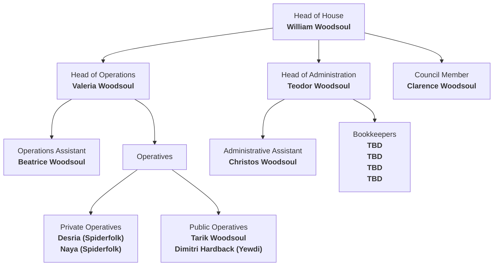

# Details
The House of Affairs is at present run via the influential family Woodsoul. Nepotistic tendencies is relatively normal in Helva and its Houses, but none quite so prolific as House of Affairs. Few members even at the lowest rungs are hired from anywhere but within the bloodline. This is argued as beneficial due to its encapsulated nature since the subject matter of Affairs is to be kept hush hush at all times.
# Officers
### William Woodsoul
William is a hard, Utilitarian man who puts the good of the House above all else, even truly his nation. He will do anything within his power to maintain his Houses good standing on the Council whilst maintaining the façade that they are helping the nation. 
### Valeria Woodsoul
Valeria was placed in this extremely powerful managerial position by her father William due to her inoccent belief in the House of Affairs Purpose. She works extremely hard to keep the country safe and does her job diligently.
### Beatrice Woodsoul
Beatrice is Valeria's twin sister, and is very jealous of her sister's place of power over her. She has been planning a way to quietly remove her from power for some time, but Valeria consistently impresses the Council and even more so the House.
### Teodor Woodsoul
A money grubbing man of shrewd business Teo has his financial fingers in far more of the nation and Houses than should be possible. He largely shirks the majority of actual administration duties since Valeria will "take care of it" and does his "duty" by maintaining monetary bribery and blackmail wherever he can. This does of course get classified as part of the Houses Purpose.
Teodor is William's older brother
### Christos Woodsoul
Son of Teodor Christos mostly attempts to get by without doing any real work, however Valeria often finds him when he would least like her to and has some project or idea or work related thing she wants him to relay to his father.