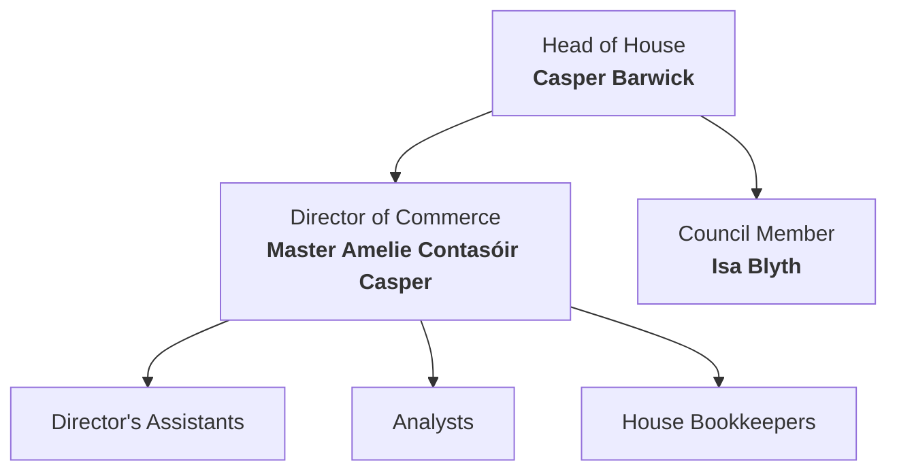

# Officers
### Casper Barwick
Casper is a dangerous man; having large scale control and responsibility of the nations coffers. He has a tense but positive relationship with [[The House of Affairs#Teodor Woodsoul|Teodor Woodsoul]] of [[The House of Affairs]] who is regularly asking for large liquid loans to be used for "House of Affairs Purposes". Casper is a very thin, sharp human man with barely visible [[Tieflings|Tiefling]] discoloration around his neck and wrists.
### Master Amelia Contasóir Casper
Casper's wife, she is roughly 40 years older than him, but is a Rugadhian woman so shows little of her long life. She has an incredible mind for accounting and deal making, securing her position in the house first before love blossomed.
### Isa Blyth
