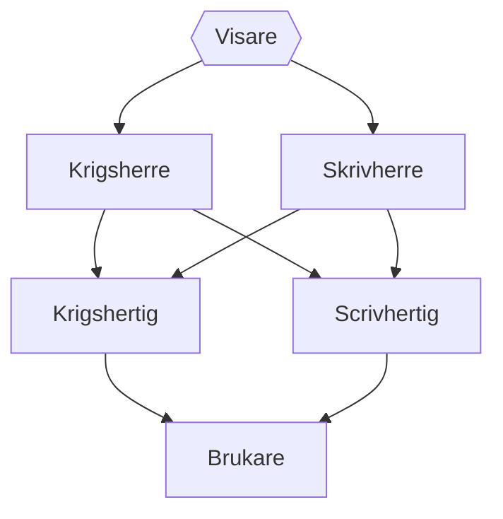

A nation that takes pride in its military the Ornsiire Empire is the origin of both of the most influential mercenary organizations, spreading its influence across the continent. Few desire conflict with Ornsiire, knowing that a war of any scale would bring about extreme casualties to their side regardless of the final outcome. 
# Government

### [[Visare]]
![[Visare]]
### Krigsherre
The Krigsherre are the highest noble class beneath the Visare, to become a Krigsherre one's family must be capable of mustering more than five thousand well armed men at the Visare's command. There are currently four Krigsherre, fewer than ever in the Empire's history. Despite this number being low for Ornsiire, it is still more troops in a moments notice than any other nation could manage in several months.
### Skrivherre
### Krigshertig
### Scrivhertig
# Founding History
From humble [[Attovia/Timelines/Civilizations Timeline/Ornsiire founded|origins]] Ornsiire's governor [[Gnaeus Metellus]] lifted the city state through rigorous militarization. Those who aided the machine of military progress were rewarded and those who might harm it were snuffed out. In less than a century Ornsiire had already brought several other surrounding villages into the fold under Gnaeus' rule. He quickly found a worthy successor who would carry on his vision of a nation protected by the invincible shield of pre-war time innovation. Roughly a century later despite [[Zoher|Zoher's]] hesitancy Ornsiire became officially recognized as a minor empire, and continued steady growth since.