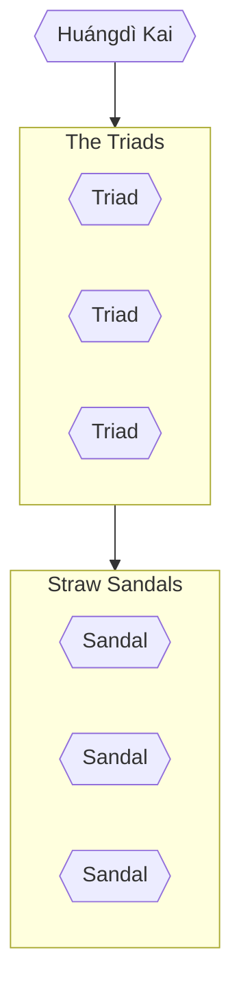

Whispers of the [[Huángdì Kai]]^[Emperor Kai] permeate every ear in the [[Shen Dynasty]], but nowhere is his presence more felt than [[Frihet City]]. It is well known to even the naïve that if the Emperor of The Underground wants it, he will have it. His realm snakes from dark alleys of the [[Frihet City#West Gate|West Gate]] into the [[Fu Clan Palace]] itself. Nary a word can be spoken without his hearing it, and no act committed without his knowledge. One cannot be a thief or con-man for long without paying tribute in some form to the Emperor, but only a select few will ever have an audience with the figure himself.
# Hierarchy

The Underground technically reaches much farther than the Shen Dynasty, with Triad's in most nations commanding Sandals in almost every capital. Each Triad has a specific tattoo worn as undeniable proof of ones membership, those who refuse to receive it have their loyalty questioned.
## Triad Shé yǎo shāng^[snake bite]
The snake bite Triad is responsible for The Underground's reach in the Shen Dynasty as well as portions over the border into [[Zoher]] and the [[Kingdom of Helva]]. It is the only Triad without a Báisè zhǐ shàn^[White Paper Fan] instead lead directly by the Emperor. 
#### Tattoo
The Snake Bite tattoo is a long winding [[Asp]] that coils from the upper left arm across the lower collar bone and ends wound around the upper right arm, its mouth open fangs bared downward on the tricep facing the elbow.
#### Frihet City
Here the Emperor resides physically deep underground, he makes orders to his Sandals directly who have any number of henchmen both specialized and grunts to make his word reality. Below are the most notable members within Frihet City.
- **Sandal** (Zhou Kai)
	- Zhou Kai's right hand woman Darin, a **[[Yewdi]]** who silently carries out his bidding unquestioningly. She is covered in a strange mix of traditionally Giravian tattoos and new Triad tattoos.

