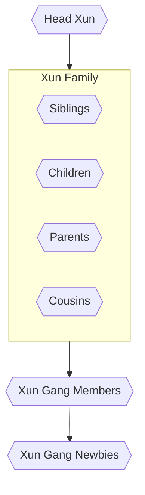

The Xun Gang though functioning largely on their own terms is at the top a subsidiary of [[The Underground]], a kind of orphan Triad with less official connection to the [[Huángdì Kai]] and more of a raw transactional one. The Xun Gang attempts to keep this knowledge suppressed even within the gang as much as possible hoping to make a name for themselves that is not superseded by the infamous Kai family.
# Structure
The Xun Gang functions without a rigid hierarchy instead preferring to function fluidly based around social currency and the contracts of loyalty. Those who betray the gang are punished with extreme prejudice. The head of the gang is the current patriarch or matriarch of the Xun family, called the Head Xun, and has total authority so long as that authority doesn't begin to directly contradict the gang's history, values and or undermine the gang's reputation.

Implicitly there exists a kind of four tier grouping that flows from the Head Xun to direct Xun Family, then to other Xun Gang Members and finally to newbies recently inducted into the gang.

Notably uncles and aunts are not permitted to join the gang ensuring that marriage is never a way into the inner circle, and having the additional benefit of keeping Xun family partners under the radar. Those who do marry into the Xun family are not permitted to if they are not willing to change their name to Xun. Much family drama has occurred thanks to this practice, but pride and the need for absolute loyalty has maintained the practice.
# Notable Members
### Head Xun
![[Rong Xun]]
### Xun Family
#### Sisters
> [!info]+ Bo Xun
> [[Rong Xun|Rong Xun's]] elder sister and closest confidant. Bo is a scary woman and is largely responsible for family discipline.

> [!info]+ Cheng Xun
> Cheng is the baby of the family and seeks to prove her worth.
#### Brothers
> [!info]+ Wen Xun
> Wen dislikes violence and peril, and thus has taken to managing the family books with the aid of some of his cousins.
#### Cousins
> [!info]+ Ming Xun
> Daughter of Rong Xun's Aunt Chin Xun. Ming struggled initially with the idea of taking on her father's roof repair business until she realized she had a direct line to joining the Xun Gang. She is a hard worker and eager to please.

> [!info]+ Shi Xun
> Son of Rong Xun's Aunt Chin Xun. Joined the gang to keep track of his sister, doesn't really like the way the gang does things but will commit acts he deems immoral to protect his sister.

### Gang Members
