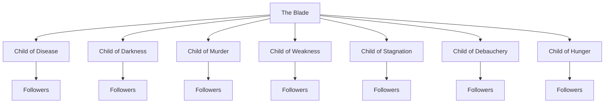

Externally referred to as the Krakens Cult, or more long form the Cult of the Kraken, internally this group of [[Graskoroth]] worshipers refer to themselves as **Those who Seek the Deep** or **Divers** when connecting/meeting in public. The end goal of the cult is to bring Grask back into power. The means is difficult though, it requires a ritual to adjust or remove the [[Contracts|contract]] between [[Hormus]] and Attovia. The majority of the cults funds and proceedings are funneled towards the research required to conquer this hurdle. 

# Internal Politics
The CotK has existed in small for several thousand years and has amassed large quantities of wealth and leverage in most majorly developed nations. Some time around [[Eras of Attovia|2800 AN]] the internal structure was hijacked by a small group who held the majority of the flow of [[Chips]]. Currently the cult’s true hidden purpose is to fuel their elite’s lust for political power and wealthy lifestyle, but enough of the stream of income is diverted to ease the mind of any would be dissenter. And if a small bribe won’t do the job, a swift removal from service has proven indispensable.
# Hierarchy 
The Cult is ruled primarily by [[The Blade]], owner and chosen one of [[Grask's Needle]]. Beneath and at times alongside The Blade are the Heralds: one to each member of [[The Hebdomad]] and each with a retinue of followers among which the next Herald must be chosen when the current passes on or is for any other reason unable to fulfill their duty as a Herald.
